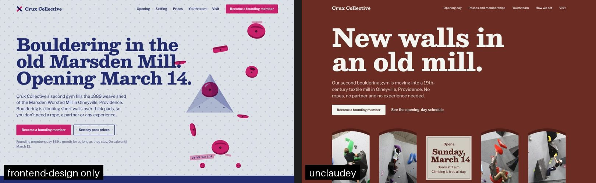

# unclaudey

**Stop Claude-built sites from looking Claude-built.**

unclaudey is an [Agent Skill](https://docs.claude.com/en/docs/agents-and-tools/agent-skills) for Claude Code. It forks Anthropic's [`frontend-design`](https://github.com/anthropics/skills/tree/main/skills/frontend-design) skill and gives it something that skill doesn't have: **real photography, chosen by Claude with its own eyes.**

- It semantically searches a local library of ~25,000 professional photos, plus live Unsplash and Openverse.
- It puts the candidates on numbered **contact sheets** that Claude looks at before choosing.
- It previews crops with the real headline in place.
- It derives the **color palette from the chosen photos**.
- It exports responsive, credited, lint-checked `` markup. Claude never has to invent an image URL again.

---

## Why vibe-coded sites all look the same

Ask any model for a landing page without direction and you get the statistical center of the web. Anthropic calls this *distributional convergence*. Their own skill lists the current tells:
- a cream background with a serif and a terracotta accent
- near-black with acid green
- broadsheet hairlines
- the SaaS card kit
- ALL-CAPS eyebrows and `→` on every button

There is one more tell that design skills don't fix: **no real imagery.** A model can't see or verify image URLs. So it either:
- invents Unsplash photo IDs that 404, or points at `source.unsplash.com`, a service that has been shut down; or
- avoids photos entirely and fills the page with gradient blobs, emoji and icon-in-a-circle cards.

Real photography of the subject's world (the studio, the food, the climbing wall, the hands doing the work) is the fastest way to make a page belong to *one* client. unclaudey makes that reliable:

| Step | What happens |
|---|---|
| **Plan** | Claude writes a design plan (upstream frontend-design method) plus an **image plan**: one photographic voice for the site, and a brief per photo slot with orientation, tone, people, and where the headline must sit. |
| **Search** | Hybrid retrieval over a local index:<ul><li>SigLIP 2 image embeddings</li><li>keyword BM25 over captions, keywords and real search terms</li><li>filters for orientation, tone, people and **copy space**, which is computed from edge density</li><li>MMR diversity</li><li>a penalty on photos you already used in other projects</li></ul>`--expand` adds live Unsplash and Openverse results, re-ranked by the same model. |
| **Look** | Numbered contact sheets, then finalist crops at 16:9 and 4:5 with the real headline drawn in and its contrast measured, then a "set" view to check the photos read as one voice. |
| **Palette** | k-means in OKLab over the chosen photos gives `--color-*` tokens with WCAG checks. It warns if the result lands on a known generated-looking palette. |
| **Ship** | Resolves each photo through the Unsplash API (with download tracking), then exports `srcset`/`sizes`, `width`/`height`, focal-point `object-position`, blurhash placeholders and credits. It has an `inline` mode for Claude artifacts, where external images are blocked. |
| **Check** | `lint` fails on invented Unsplash URLs, dead `source.unsplash.com` links, `` without `alt`, and draft photos. It warns on layout shift, lazy heroes and missing credits. |

## Install

In Claude Code:

```
/plugin marketplace add ramialdine/unclaudey
/plugin install unclaudey@unclaudey
```

Or, with the open skills installer:

```bash
npx skills add ramialdine/unclaudey
```

Or copy `skills/unclaudey` into `~/.claude/skills/`.

**Requirements:**
- [uv](https://docs.astral.sh/uv/). It provisions Python and every dependency on first run. Install it with `brew install uv`, or see its docs.
- About 3 GB of disk: 1.2 GB for the photo index and 1.5 GB for the model.
- A GPU is optional. Apple Silicon uses Metal; everything also runs on CPU.

## First run

The first time the skill runs, Claude checks the setup (`doctor`). If the photo index is missing, Claude asks you to agree to the **[Unsplash Dataset Terms](https://github.com/unsplash/datasets/blob/master/TERMS.md)**:
- you may download the dataset and use it internally to build a search index
- you may not redistribute or publish it

With your yes, Claude builds the index in the background. It downloads about 320 MB of data and 25k thumbnails, then computes embeddings. That takes about 10–20 minutes, once per machine. The index lives in `~/.cache/unclaudey/` and is shared by all your projects.

You can also run setup yourself:

```bash
uv run ~/.claude/skills/unclaudey/scripts/unclaudey.py setup --accept-unsplash-terms
```

(Adjust the path to wherever the skill is installed. For plugin installs, Claude knows the path.)

### Your free Unsplash key (2 minutes, needed before publishing)

Searching works without a key. To *publish* photos you need your own key: the Unsplash API guidelines require official URLs, download tracking and credits.

1. Sign in at [unsplash.com/oauth/applications](https://unsplash.com/oauth/applications), click **New Application**, accept the API terms, and name it `unclaudey`.
2. Copy the **Access Key** (not the secret key).
3. Save it where unclaudey (and only unclaudey) reads it:

```bash
mkdir -p ~/.config/unclaudey && printf 'UNSPLASH_ACCESS_KEY=paste_your_access_key\nUNSPLASH_APP_NAME=unclaudey\n' > ~/.config/unclaudey/.env && chmod 600 ~/.config/unclaudey/.env
```

Each person uses their own key; don't share or commit it.

**What the key costs you:**
- New apps get 50 requests/hour, which is plenty. Searching the local index uses **no** requests, and each photo you actually use costs about 2 (a 5-photo page is about 10).
- Unsplash can approve your app for production (1,000/hour) if you ever need more.
- Environment variables with the same names override the file.

## Using it

Just ask Claude Code for a site:

> Build a landing page for Kiln & Kin, a small ceramics studio in Portland that teaches wheel-throwing classes.

Claude plans the design and image plan, searches, reviews contact sheets, picks, derives the palette, exports and lints. You can also drive the CLI yourself:

```bash
UC="uv run ~/.claude/skills/unclaudey/scripts/unclaudey.py"
$UC doctor
$UC search "misty pine forest at dawn, soft light" --orientation landscape --copy-space left
$UC search --plan .unclaudey/plan.json [--expand unsplash,openverse]
$UC sheet finalists --slot hero --picks 3,7,9 --crops 16:9,4:5 --copy-space left --headline "Throw your first bowl"
$UC sheet set
$UC palette [--theme light|dark]
$UC resolve
$UC export --mode hotlink|inline|download [--out public/images]
$UC lint index.html
```

Files it writes in your project's `.unclaudey/` folder:
- `plan.json`
- `candidates.json`
- `sheets/*.jpg`
- `selection.json`
- `palette.css`
- `resolved.json`
- `images.manifest.json`
- `snippets.html`

## How good is the search?

[`benchmarks/RESULTS.md`](benchmarks/RESULTS.md) has the full, honest numbers. In short, from a 25-brief spot-check on the local index:
- **When the library has the subject** (the tool labels coverage *good*), 11 of 12 briefs return at least 9 of 12 on-brief candidates, with filters working: copy space, people, tone and color. Planning 25 slots takes about 8 s, most of it loading the model.
- **When it doesn't** (specific trades like dental clinics, mechanics and pottery wheels), the tool labels coverage *weak*: it caught 6 of 6. The skill then re-runs that slot against the full Unsplash library with `--expand unsplash`, instead of settling for a near-miss.
- **Planted mistakes:** `lint` catches invented Unsplash IDs, the dead `source.unsplash.com` service, missing `alt`, placeholder services, layout-shift risks and missing credits.

### A/B vs Anthropic's `frontend-design`

The setup: the same three briefs, each built by fresh Claude sessions with a single skill installed. Without the photo pipeline, the model used **0 photos across 3 pages**. It drew SVG or CSS instead, even for a climbing gym and a ceramics studio. With unclaudey, every page shipped 4–5 real, credited photos, and **none were broken**.



<sub>Right-hand photos by [Grant.C](https://www.flickr.com/photos/69663188@N00) on Flickr, [CC BY 2.0](https://creativecommons.org/licenses/by/2.0/), found via Openverse.</sub>

Honest verdict: unclaudey clearly won climbing, ceramics was a split, and invoicing was a tie. The baseline skill is already good, and both arms still converged on fonts and concepts for the same brief. Details, method and caveats are in [`benchmarks/RESULTS.md`](benchmarks/RESULTS.md). To reproduce, run `benchmarks/run_ab.sh` (headless Claude Code).

## Limitations (honest ones)

- **The local library is 25k photos, mostly from 2017–2020.** It is strong on landscapes, cities, architecture, interiors, food, textures and lifestyle. It is thin on specific trades and services. The tool detects this, labels the slot's coverage *weak*, and uses live Unsplash search instead. That needs your free key, and it's where most niche briefs end up.
- **Each `search` call takes about 6 s** to load the model, then about 0.1 s per slot. Batch all slots into one plan. (A persistent server is on the roadmap.)
- **Openverse** (keyless) rate-limits anonymous use hard: 20 requests/min, 200/day, and sometimes bot protection. Treat it as a bonus, not the main path.
- **Claude Code and local agents only for now.** claude.ai's web sandbox can't download the dataset or model, so the local index can't be built there.
- **It's a design aid, not a guarantee.** Claude still makes the final call on the contact sheets. If nothing fits, the skill tells it to change the design rather than force a photo.

## Licensing and data

The code is under the **Apache-2.0** license.

`skills/unclaudey/SKILL.md` is derived from Anthropic's Apache-2.0 [`frontend-design`](https://github.com/anthropics/skills/tree/main/skills/frontend-design). The changes are listed in [NOTICE](NOTICE).

Data, services and models are downloaded by each user under their own terms and are **not** redistributed here:
- **Unsplash Dataset Lite** is a local, private search index only. Never commit or share `~/.cache/unclaudey/`.
- **Unsplash API** uses your own key and follows the [API guidelines](https://help.unsplash.com/en/articles/2511245-unsplash-api-guidelines): hotlinking, download tracking, and attribution with UTM links.
- **Openverse**: only licenses that allow commercial use and modification are requested, and attribution is exported.
- **SigLIP 2** weights (Google, Apache-2.0) are loaded through [open_clip](https://github.com/mlfoundations/open_clip). unclaudey deliberately doesn't ship research-only models, because what people build with it is commercial work.

See [skills/unclaudey/references/licensing.md](skills/unclaudey/references/licensing.md) for details.

## Works well with

- [Impeccable](https://github.com/pbakaus/impeccable): audits with 61 deterministic anti-pattern detectors (`npx impeccable detect`).
- [Taste-skill](https://github.com/Leonxlnx/taste-skill): variance, motion and density "dials".
- [UI/UX Pro Max](https://github.com/nextlevelbuilder/ui-ux-pro-max-skill): style, palette and font databases.
- [Refero MCP](https://refero.design/mcp): real product screens for UI pattern research.

## Roadmap

- [ ] Persistent search server (MCP) so the model stays loaded between searches
- [ ] Public-domain and CC0 index (PD12M subset) for editorial and archival looks
- [ ] Pexels provider (photos + short video loops)
- [ ] Optional generated-image fallback for subjects no library covers
- [ ] Texture and pattern library for backgrounds

## Credits

- Built on Anthropic's [frontend-design](https://github.com/anthropics/skills/tree/main/skills/frontend-design) skill.
- Photos by the photographers of [Unsplash](https://unsplash.com) and [Openverse](https://openverse.org) contributors.
- Semantic search by [SigLIP 2](https://arxiv.org/abs/2502.14786) through [open_clip](https://github.com/mlfoundations/open_clip).
