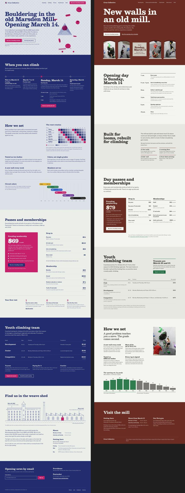

# Results

Honest notes from building and testing unclaudey. Every number here comes from a run on a MacBook with an Apple M5.

Nothing in this file compares the Unsplash Dataset with other datasets. The dataset terms forbid publishing that kind of comparison. The sections below evaluate *unclaudey's retrieval and workflow*.

## 1. Retrieval spot-check: 25 briefs, local index only (2026-09-23)

**Setup:**
- Model: SigLIP 2 ViT-B/16 at 256px (Apache-2.0).
- Index: 24,997 photos from Unsplash Lite 1.4.1, embedded in 159 s (158 photos/s in fp16 on Metal).
- Planning 25 slots took 8.1 s in total: about 6 s to load the model, then about 0.1 s per slot, including rendering its contact sheet.

**Method:** I looked at every contact sheet myself and counted how many of the 12 candidates actually show the brief's subject. "Coverage" is the label the tool itself printed; it's computed from the top-5 raw similarity.

| # | Brief (filters) | Coverage label | On-brief of 12 | Notes |
|---|---|---|---|---|
| 1 | wet hands shaping clay on a pottery wheel (landscape, copy space left) | weak | 0 | The library has almost no pottery-wheel photos |
| 2 | sunlit ceramics studio with shelves of bowls (portrait, no people) | fair | 2 | Mostly plant shelves |
| 3 | climber on an indoor bouldering wall (portrait, people) | fair | 2 | Outdoor rock only |
| 4 | chalk-covered hands of a climber, close-up | good | 4 | Hands in sand, clay and stone; the label overestimates |
| 5 | barista pouring latte art in a dim cafe (landscape) | fair | 8 | Coffee and cafés, but no latte-art pour |
| 6 | sourdough loaves on a wooden table (landscape, no people) | weak | 0 | 3 bread photos in the whole library |
| 7 | bright modern dental clinic room (landscape) | weak | 0 | Generic bright interiors |
| 8 | minimal concrete facade, strong shadows (portrait, no people) | good | 12 | |
| 9 | bride and groom in a field at golden hour (landscape, people) | fair | 11 | The label underestimates |
| 10 | handmade paper texture with ink (copy space center) | good | 10 | Calm-centered textures |
| 11 | aerial view of a turquoise coastline (wide) | good | 12 | |
| 12 | neon-lit rainy street at night (portrait, dark) | good | 12 | |
| 13 | person doing yoga on a mat in a bright room (landscape, people) | weak | 3 | |
| 14 | overhead view of colorful vegetables | fair | 8 | |
| 15 | hiker on a ridge above clouds (landscape, copy space top) | good | 12 | Calm sky where the headline goes |
| 16 | florist arranging dried flowers (portrait) | good | 12 | |
| 17 | mechanic working on a car engine (landscape) | weak | 0 | 1 mechanic photo in the library |
| 18 | cozy living room with plants (landscape, no people) | good | 9 | |
| 19 | guitarist on stage under warm spotlights (landscape, dark) | good | 9 | |
| 20 | stacks of old books in a library (portrait) | weak | 5 | |
| 21 | cyclist on an empty country road (wide) | fair | 2 | Roads, few cyclists |
| 22 | macro close-up of a circuit board (landscape) | fair | 2 | Tech-adjacent hardware |
| 23 | steam rising from tea on a windowsill (portrait) | good | 9 | |
| 24 | city skyline at blue hour (wide, copy space top) | good | 12 | |
| 25 | desert landscape, leaning to #c86b3c (landscape) | good | 12 | Warm-toned dunes |

**What this says:**
- **Label "good" (12 briefs):** 11 of 12 had at least 9 of 12 candidates on-brief. When the local library has the subject, the search is strong, filters included:
  - copy space: calm sky exactly where the headline goes
  - people: none or required
  - tone: dark
  - color targets
- **Label "weak" (6 briefs):** all six really were poor (0–5 on-brief). The detector caught every one. The library is thin on specific trades and services, so the skill tells Claude not to choose from those sheets and to re-run the slot with `--expand unsplash`.
- **Label "fair" (7 briefs):** mixed (2–11 on-brief). Claude is told to check the subject closely and expand if it's missing.
- **Overall:** from the local index alone, 14 of 25 briefs are clearly on-brief (≥ 8 of 12). The rest need live search, which is why `--expand` exists.

**Fixes the spot-check drove, before this run:**
- **Copy-space filter bug:** "left" was never mapped to its stored region score, so the filter did nothing.
- **Keyword noise:** "potter" matched owl photos that people downloaded after searching "harry potter". Keyword relevance now only counts for photos that also match visually.
- **Hub photos:** a few photos (a teal abstract, a blue water swirl) showed up for unrelated queries. Search now subtracts part of each photo's hubness, its mean top-10 similarity to 800 real captions.
- **People detection:** the keyword labels tagged "adult cheetah" and "a field with no people" as people. The zero-shot image signal switched to a softmax over subject prompts: AUC 0.86 → 0.89 against cleaned labels, 91% precision at the "no people" cutoff.
- **Model choice:** the first prototype used MobileCLIP2. Its weights are licensed for research only, so it was replaced with SigLIP 2 (Apache-2.0) before any release.

## 2. Pipeline checks

| Check | Result |
|---|---|
| `doctor` | all green; 24,997/25,000 thumbnails, 3 failed downloads |
| `sheet finalists` | 16:9 and 4:5 crops with the real headline; measured text contrast 9.1–13.4:1 |
| `palette` | tokens from 3 photos; ink/bg 12.5:1, muted/bg 4.6:1, accent/bg 3.2:1, accent-ink/accent 5.3:1 |
| `export --mode hotlink` | srcset 480–2560w, width/height, focal `object-position`, blurhash placeholder, credits with UTM links |
| `export --mode inline` | 3 photos as WebP data URIs, 177 KB total (3 MB budget) |
| `export` without a key | blocked for drafts unless `--allow-draft` (local previews only) |
| `lint` on a page with planted mistakes | exit 1. Caught an invented Unsplash ID, `source.unsplash.com`, a missing `alt`, a picsum placeholder, missing dimensions and a missing credit |
| `lint --network` on the exported page | exit 0, all images load |
| Plugin install in an isolated `CLAUDE_CONFIG_DIR` | installs; ~140 tokens always-on, ~4.8k tokens when the skill runs |

## 3. A/B: Anthropic `frontend-design` vs unclaudey (2026-09-23)

**Method:**
- Three briefs from `briefs.json`, each built twice.
- Every page was built by a fresh, independent Claude session (same model, same prompt). Each session had exactly one design skill installed: Anthropic's `frontend-design`, or `unclaudey`. These were Claude Code subagents; `run_ab.sh` does the same thing with headless `claude -p`.
- Four of the six sessions hit account usage limits during their final screenshot checks, after they had already written their pages. The pages are evaluated as written.
- Screenshots: Chrome with reduced motion, 1440×900 and 390×844 (`screenshot.py`, `collect.py`).

*Photos in the unclaudey build (right): "IMG_6793", "IMG_6799", "IMG_7018", "IMG_6787" and "IMG_6804" by [Grant.C](https://www.flickr.com/photos/69663188@N00) on Flickr, licensed under [CC BY 2.0](https://creativecommons.org/licenses/by/2.0/). They were found and credited through Openverse by `search --expand openverse`. The left page contains only the model's own SVG drawings.*

Full pages, same brief (left: frontend-design only, right: unclaudey)

| | frontend-design only | unclaudey |
|---|---|---|
| Real photographs used | **0 / 0 / 0** | **5 / 5 / 4** (ceramics / climbing / invoicing) |
| Broken or invented image URLs | none (no images) | **none**: `lint --network` found 0 errors on all 3 |
| Photo credits on the page | n/a | yes, on all 3 |
| Imagery instead | canvas animation and SVG pots; SVG holds and a mill drawing; CSS form mockups | a black-and-white documentary set; arched "mill window" photo frames; one row of four freelancer-city photos |

**Verdicts (by eye, honest):**
- **Climbing: unclaudey.** Real indoor-bouldering photos make it look and feel like an actual gym. Both builds chose the *same* fonts (Besley with Libre Franklin), so the photography is what separated them.
- **Ceramics: split.** The baseline's interactive canvas pot is the more striking first screen. unclaudey's page reads as a real studio. There the library had coverage *fair* or *weak*, so the build expanded to Openverse and unified the mixed sources in black and white.
- **Invoicing: tie.** Both converged on the same "three ledger lines" hero concept. unclaudey used photos only where they earn a place (one row of freelancer cities), which is the restraint the skill asks for on an API page.

**What this says:**
1. **Your hypothesis holds.** Without a way to get real, verified photos, the model avoids photography entirely: 0 photos across 3 pages, even for a ceramics studio and a climbing gym. With the pipeline, every page carried real, credited photos, and none were broken.
2. **Photos aren't the whole story.** Anthropic's current `frontend-design` already avoids most of the "Claude look". For the same brief, both arms still converged on fonts and hero concepts. Future work: diversification for type and concept, not just imagery.
3. **Cost.** The skill's review loop is thorough, and early runs over-explored (19 slots on one page, plus trying an off-pipeline stock site). SKILL.md now has two rules: *use only photos from this pipeline*, and *keep the run lean*.

The ceramics and invoicing unclaudey screenshots aren't published here. Those builds include unresolved (draft) Unsplash photos, and the dataset terms don't allow publishing them. They'll be added after the photos are resolved through the Unsplash API.
